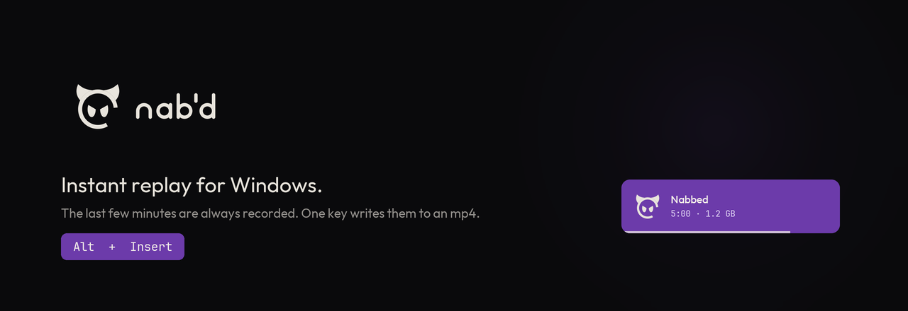
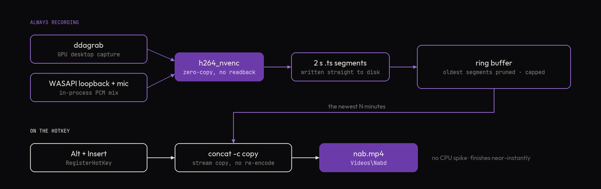
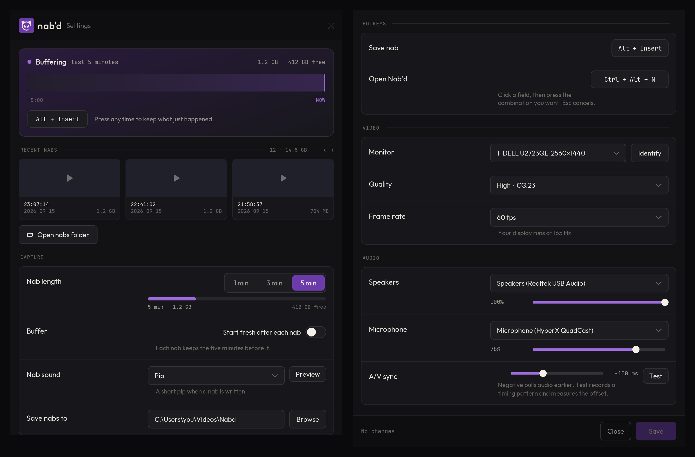
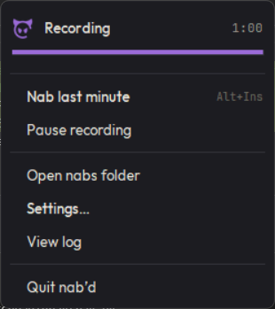
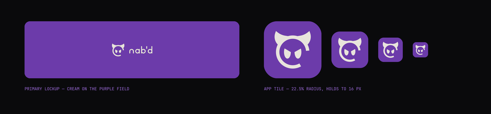
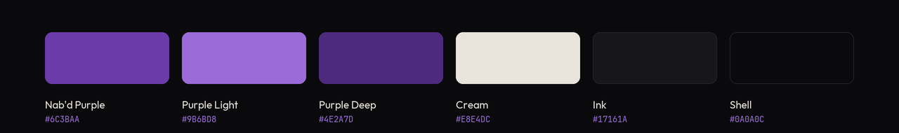
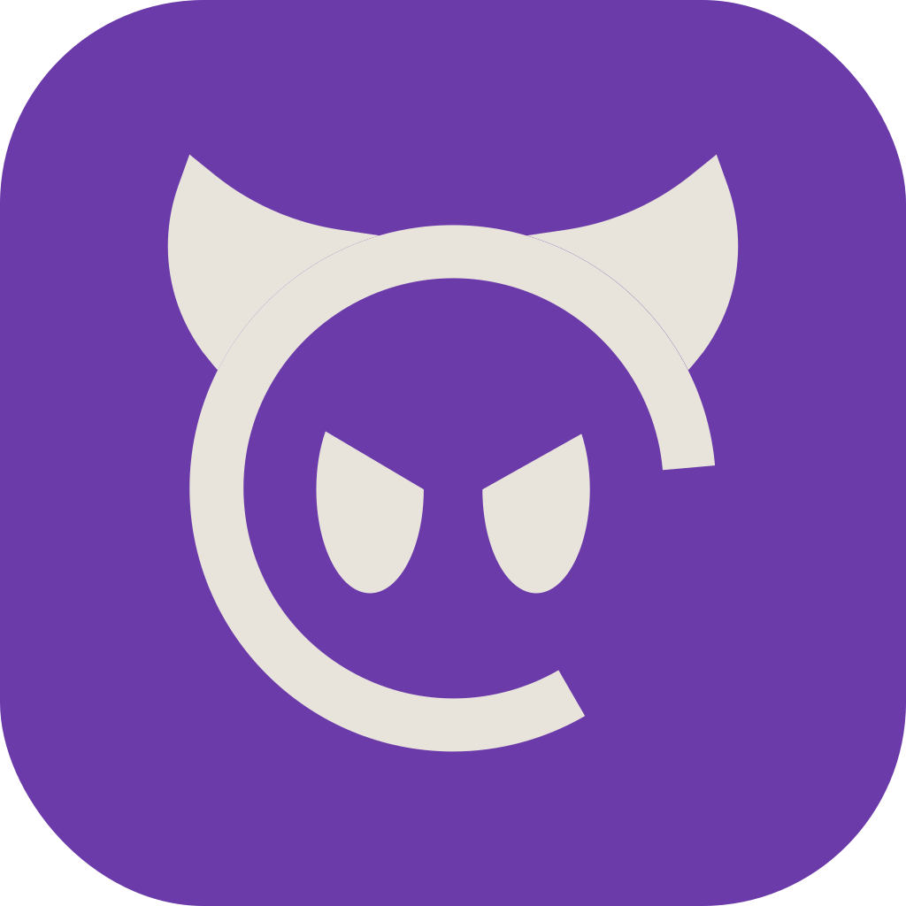

<div align="center">



<p>
  <a href="https://github.com/ethanbxi/Nabd/releases/latest"></a>
  
  
  
</p>

</div>

---

A minimal instant-replay buffer for Windows. It continuously records your
screen in the background; pressing a hotkey writes the last few minutes to an
mp4. That's the whole feature set.

**Press <kbd>Alt</kbd> + <kbd>Insert</kbd> to save a nab.** A banner confirms it
in the corner: *Nabbed — 5:00 · 1.2 GB*.

<div align="center">


<sub>4,120 ms, eight beats, one axis at a time. Trigger to first pixel: <b>5–7 ms</b>.</sub>

</div>

---

## Install

Download the latest **`NabdSetup`** from
[Releases](https://github.com/ethanbxi/Nabd/releases/latest) and click through
the wizard.

Nothing else is needed — no Python, no ffmpeg, no fonts, no account. It is a
per-user install, so there is **no admin prompt**, and everything lands in
your own profile:

| | |
|---|---|
| The app | `%LOCALAPPDATA%\Programs\Nabd` |
| Settings, buffer, log | `%LOCALAPPDATA%\Nabd` |
| Your nabs | your **Videos\Nabd** folder |

The wizard offers a desktop shortcut and *start when I sign in* — both on by
default. Uninstall from **Settings → Apps** like anything else; it removes the
app and the buffer and **leaves your saved nabs alone**.

> [!WARNING]
> **Windows will warn you the first time.** The installer isn't code-signed
> (a certificate costs a few hundred dollars a year), so SmartScreen shows
> *"Windows protected your PC"*. Click **More info → Run anyway**. This is the
> one way it doesn't behave like a store-bought download; there is no way
> around it short of buying a signing certificate.

### First run picks up your hardware

Defaults ship as whatever suited the machine it was built on, so anything the
local hardware can answer for itself is resolved on first launch instead:

| Setting | How it is chosen |
|---|---|
| Nabs folder | Your real Videos folder, via the shell's known-folder API — so a OneDrive-redirected Videos still resolves correctly |
| Resolution | Whatever the monitor is; capture is always native |
| Frame rate | 60, stepped **down** if the display can't sustain it (a 240 Hz panel still starts at 60 — that's a file-size judgement, not a hardware limit) |
| Encoder | Probed with a real test encode: NVENC → AMF → QuickSync → x264 |
| Speakers / microphone | The Windows defaults |
| Monitor | The primary one |

Everything is changeable afterwards in Settings.

## How it works

<div align="center">



</div>

The screen is *always* being encoded into small MPEG-TS segments, and old ones
are deleted. Saving a nab just concatenates the newest segments with a stream
copy — no re-encoding, so it finishes near-instantly and causes no CPU spike
in the middle of your game.

Two details that make it cheap:

- **Zero-copy capture.** `ddagrab` hands D3D11 textures straight to NVENC.
  Frames never leave the GPU — no PCIe readback, no CPU colour conversion. On
  machines without NVENC the encoder probe falls back and inserts the one
  `hwdownload` that those encoders need.
- **Desktop audio without drivers.** ffmpeg has no WASAPI loopback input, and
  many machines expose no "Stereo Mix" DirectShow device, so desktop audio is
  captured in-process via WASAPI loopback and piped to ffmpeg as raw PCM. No
  VB-Cable or virtual audio driver to install.

## Settings

**Click the tray icon** to open the Nab'd window — the fuller of the two
surfaces, and what the *Nab'd Settings* Start Menu shortcut opens too. Opening
it again raises the window you already have rather than stacking copies.

There is also a **drawer**: the same settings as a full-height panel that
slides in from the right and docks over the whole screen, taskbar included —
no system title bar, just an ✕ in its corner. Escape closes it, and so does
clicking on anything else; it slides back out on its own, and dropdowns and the
folder picker do not count as clicking away. That is the hotkey's surface,
because it arrives over whatever is in front without making you leave it.

<div align="center">



<sub>One drawer, shown as two columns. On screen it is a single 640px panel running the full height of the display.</sub>

</div>

**Right-clicking the icon** gives a drawn menu rather than the Windows one:

<div align="center">



</div>

The status block is the point of it. It carries a live meter, and the primary
row names **what is actually buffered** — twenty seconds in it reads *Nab last
20 seconds*, not a minute that does not exist yet. With nothing buffered it
falls back to the configured length and greys out, because a disabled row
should name the action. The accelerator follows whichever hotkey actually
registered, which is not always the one configured.

It is drawn on one canvas, so hover is a rounded pill and focus is a ring
rather than a fill. Every decision — rows, labels, enablement, keyboard order,
placement — lives in `nabd_tray_model.py`, which is pure stdlib and covered by
51 checks; the Tk file only draws. One honest cost: a custom menu is
**invisible to screen readers** and ignores high-contrast themes, which the
native menu is not.

**<kbd>Ctrl</kbd> + <kbd>Alt</kbd> + <kbd>N</kbd> opens the drawer** without
going near the tray.

<div align="center">


<sub>720 ms in two phases that never overlap — the shell docks, <i>then</i> six blocks deal out, each wiping left to right while it slips into place.</sub>

</div>

The panel is a 640px drawer with one repeated grammar: a label on the left, a
fixed 344px control column on the right, and anything secondary — a disk meter,
a volume slider, helper text — stacked *inside* that column so it stays attached
to its control and every control lines up down the page.

| Section | What you can change |
|---|---|
| **Buffer card** | Live status, how much the buffer holds and how much disk is free, the retained window as a timeline, and the save hotkey shown large |
| **Recent nabs** | The newest nabs as poster thumbnails — click one to play it, arrows to page back — and a button to open the nabs folder |
| **Capture** | Nab length (1/3/5 min) with a live size estimate and disk meter, whether to start a fresh buffer after each nab, and the nabs folder |
| **Video** | Which monitor (**Identify** outlines it in purple), quality, frame rate |
| **Audio** | Which speakers to record, which microphone, a volume slider for each, A/V sync and a **Test** button that saves a five-second nab |
| **Hotkeys** | Save a nab, and open this panel. Click a field, press the combo; it tells you if it's already taken |

Three things the panel works out rather than states:

- **The size estimate is measured, not guessed.** The ring buffer is sitting on
  disk in 2-second segments written by the encoder that actually won the probe,
  so the byte rate is one `stat` away and tracks scene complexity live. Only
  when the buffer is cold — or stale, because the recorder is stopped — does it
  fall back to a bits-per-pixel model.
- **The frame-rate list comes from the display.** You cannot capture more
  distinct frames than the monitor presents, and a rate that is not an even
  division paces unevenly, so the list is derived from the refresh rate and a
  non-divisor is flagged rather than blocked.
- **Disk pressure is guarded.** Past 60% of free space the meter goes amber;
  past 85% it goes red, explains the numbers, and blocks Save on that field.

Save stays disabled until something actually changes, and the discard button
reads **Close** when there is nothing to lose and **Cancel** when there is.

Saving applies within a couple of seconds — **no restart**. The running app
watches `config.json`, rebuilds the capture pipeline, and rebinds the hotkey in
place. Editing `config.json` by hand works the same way.

Choosing **1 minute** buffers only 1 minute, so it also uses proportionally
less disk.

<details>
<summary><b>A few things are only in <code>config.json</code>, not the window</b></summary>

<br>

| Key | Default | Notes |
|---|---|---|
| `save_delay` | `3.0` | Settle time before assembling. The segment being written when you press the key is still open, so a nab assembled instantly ends *before* the keypress. This waits for it to close, and picks up a couple of seconds of aftermath. Lower it for a snappier banner, but not below `segment_seconds`. |
| `segment_seconds` | `2` | Ring granularity, and what nab length rounds to |
| `banner_delay` | `0.2` | Beat between the keypress and the banner sliding in. Set to `0` for instant. |
| `preset` | `p5` | NVENC preset. `p4`/`p3` cost less GPU time if capture struggles under load |
| `encoder` | `auto` | Force one of `h264_nvenc`, `h264_amf`, `h264_qsv`, `libx264` instead of probing |
| `hotkey_alt` | `""` | A second combo that also saves a nab. `RegisterHotKey` is first-come-first-served, so a key another app claimed first can never be taken from it — set the key you actually want as `hotkey` and a free one here, and Nab'd keeps asking for the first in the background while the second works. |
| `draw_mouse` | `true` | Include the cursor |

`audio_offset_ms` starts at `-150`, measured against a flash/tone reference.
Capture latency accounts for only part of that, so it is a starting point
rather than a constant — the Audio section exposes it as a slider. Save a nab,
watch it, and nudge until speech lines up.

</details>

## Is capture healthy?

Every minute, Nab'd logs what the encoder is really doing (tray → *View log*):

```
capture health: 59.8 fps, +3 duplicated, 0 dropped
```

- **fps** should sit near your target. Much lower means capture is being starved.
- **duplicated** is the number that matters. Desktop Duplication only hands over
  a frame when the screen *changes*, so a large count means the capture is
  frozen — almost always exclusive fullscreen. On an idle desktop a high count
  is normal and harmless.
- **dropped** should stay near zero.

If duplicates climb during a game, that is the fullscreen problem below, not a
performance problem.

## Fullscreen games — important

> [!IMPORTANT]
> **Run your game in Borderless Windowed** (sometimes "Windowed Fullscreen").

Nab'd captures the screen with DXGI Desktop Duplication. When a game takes
*exclusive* fullscreen, Windows hands the display to that game and Desktop
Duplication is cut off with `DXGI_ERROR_ACCESS_LOST` (`887a0026`). You get
frozen frames and repeated capture restarts. This is a limitation of the
Windows API, not something a setting here can fix.

Borderless costs essentially nothing on a modern GPU and makes capture work
perfectly. Most games default to it.

If capture keeps losing the display, Nab'd says so in the same corner rather
than letting you find out when a nab turns out to be frozen:

<div align="center">


</div>

The only way to capture exclusive fullscreen is to inject into the game and
hook its present calls, which is what OBS Game Capture does — and precisely the
behaviour anti-cheat systems flag. Nab'd deliberately does not do this.

## Things worth knowing

- **Disk.** The buffer holds exactly your chosen length. At 1440p60 on High
  with real motion that is roughly **1.1 GB for 5 minutes**, 225 MB for 1
  minute; a still desktop compresses to a small fraction of that. Capped and
  self-pruning, not growing. The settings window estimates it live. Drop to
  Medium if you want it smaller.
- **Audio is mixed before ffmpeg sees it.** Desktop and mic are combined
  in-process into one PCM stream. Handing ffmpeg two audio inputs puts `amix`
  on the same filtergraph thread as `ddagrab` and costs roughly two thirds of
  the video frame rate.
- **Two ways to handle overlap**, set in Settings → Nab length:
  - *Rolling buffer* (default): always keeps the most recent footage. A nab is
    the last N minutes ending at the keypress, so nabs taken close together
    share most of their footage. While the app has been running for less than
    the buffer length there is simply less footage than that, so early nabs are
    shorter and all start at the moment you launched it.
  - *Start a fresh buffer after each nab*: the footage a nab used is discarded,
    so the next one begins where the last ended and nothing repeats. The
    segment ffmpeg is mid-way through writing cannot be deleted on Windows, so
    expect up to about four seconds of carry-over.
- **Nab length rounds to 2s.** Segments are the unit of assembly, so a nab is
  ~300s ± 2s rather than exactly 300.
- **The banner confirms right away; the nab finishes a moment later.** The
  helper that draws it stays resident and watches a trigger file, so trigger to
  first pixel is 5–7 ms once its frames are loaded.

  The motion is 4,120 ms: a 4px line slides out of the corner, holds, the card
  stands up out of it, the mark draws its ring on, grows horns and opens its
  eyes as the copy fades up, the dismiss rule drains for 2.6s, the mark turns,
  tilts, squashes and winks as one action and unwinds, then the eyes close, the
  horns retract, the ring winds back, the card collapses onto the line, holds,
  and the line withdraws into the corner. Five things carry it and all of them
  are easy to undo by accident — **one axis at a time** (horizontal and vertical
  never move in the same millisecond, or the two read as a diagonal), **the 60ms
  and 70ms holds** that separate the beats, **asymmetric easing** (the collapse
  decelerates because it comes to rest on the line, and only the final slide
  accelerates, because it actually leaves), **the horns never translate** —
  they scale about their roots on the rim, and the only rotation applied pivots
  at the head's centre, or they visibly tear off — and **the turn is a head
  turn, not a rotation**: the silhouette holds and the features move across it,
  where a `rotateY` would read as a squash.

  The eyes finish opening at 900ms, exactly where the ring closes and the
  sound's B3 resolves — one event, one note. The wink is deliberately silent.

  The size is not known when the banner opens — assembly is still running — so
  it appears with the nab length and the figure is filled in afterwards, in
  place, without restarting the timeline.
- **A failure is the same banner, refusing.** It arrives identically — same
  slide, same rise, same ring draw, same horns, same eyes landing on 900 — and
  leaves identically. Only the ground and the gesture in the hold differ: it
  shuts both eyes and shakes its head, five decaying traverses at about 3 Hz.
  That is what makes it read at a glance from the corner of a screen. A banner
  that *arrived* differently would just look like a different app; one that
  arrives the way you have seen forty times and then refuses is unmistakable.

  The entry and exit tracks are shared with the save banner **by reference**,
  not copied, and the build asserts that all 247 poses inside those windows
  render to the identical picture. The ground is `#8E3229` rather than the
  palette's danger red, because cream on that measures 4.21:1 — which would
  make the failure copy *harder* to read than the success copy. The sound is
  the same six beats at the same length and level, with a tritone where the
  fifth was. The shake, like the wink, is silent.
- **A nab covers slightly past the keypress.** By design — see `save_delay`.
  Encoding runs with no B-frames and no lookahead so footage reaches disk
  promptly, and ffmpeg runs at above-normal priority so a busy game cannot
  starve it below its target frame rate.
- **<kbd>Alt</kbd>+<kbd>F9</kbd> and <kbd>Alt</kbd>+<kbd>F10</kbd> belong to
  NVIDIA ShadowPlay.** Avoid them. If a hotkey is taken at launch, Nab'd warns
  in the tray and keeps retrying in the background — recording is never blocked
  by a hotkey problem.
- **Anti-cheat.** The hotkey uses Win32 `RegisterHotKey`, the official system
  API. It installs no keyboard hook and does not inject into games, which is the
  behaviour anti-cheat systems object to.
- **The banner never steals focus.** It is marked `WS_EX_NOACTIVATE`, so it
  cannot pull input out of a game. It may not draw over *exclusive* fullscreen
  (borderless is fine).
- **The buffer survives a capture crash.** If ffmpeg dies (display lost, driver
  reset), it restarts in 0.4s and *keeps* everything already recorded. Segments
  are written under a per-session prefix, and a nab can span the seam.
- **ffmpeg can't be orphaned.** The capture process is held in a Win32 job
  object with kill-on-close, so it dies with the app even on a Task Manager kill
  or a crash.
- **Only one instance runs.** Guarded by a named mutex, so autostart plus a
  manual launch won't produce two recorders fighting over the buffer.
- **HDR.** If you turn on Windows HDR, `ddagrab` output will need tone-mapping
  and nabs may look washed out. Not currently handled.

## Brand

The interface follows the Nab'd visual identity.

<div align="center">





</div>

Three rules shaped the code:

- **The contrast rule.** Nab'd Purple `#6C3BAA` measures 2.7:1 on the near-black
  shell, under the 3:1 floor for UI shapes. So purple appears as linework only
  in Purple Light `#9B6BD8`; full-strength purple is used exclusively as a
  *field* with cream on top, which clears 7.2:1. `theme.FIELD` and
  `theme.ACCENT` keep the two roles separate, and the UI tests assert it. The
  installer's wizard panel is the same rule at a larger size — a purple field,
  cream lockup.
- **The artwork comes from the supplied SVGs, and nothing redraws it.**
  `render_assets.py` rasterises `brand/*.svg` into `brand/render/*.png` once;
  the app loads those and scales them down. `brand.py` holds the artwork's
  measurements — box sizes, the tile's 22.5% radius, where the mark sits inside
  it — but uses them only to place and scale the art, never to draw it.

  That is a change. The mark used to be transcribed into arc geometry so Tk
  could draw it at any size; it is a horned head now, whose horns and eyes are
  bezier paths, and a transcription would be a second copy of the artwork free
  to drift from the first. There is deliberately no geometry fallback left: a
  missing render leaves a hole and a warning, because the old fallback silently
  drew the retired logo.
- **The mark never rotates, and the bite stays open.** The ring is a 295.3°
  stroke with a 64.7° bite at 4 o'clock — the horns have the top. The banner
  traces that stroke on as it arrives and retraces it away as it leaves, along
  the same path, which is why the 4,120 ms timeline and the sound files
  survived the overhaul untouched. Rotating the mark would turn a ring buffer
  into a loading spinner, so nothing spins; the head *tilts and turns*, pivoted
  at the neck, which is a different thing.
- **The horns appear exactly once.** Whichever element is alone wears them: a
  wordmark on its own is the horned `n`, and every lockup — where the mark is
  already present — takes the plain one. `brand.wordmark_image()` defaults to
  plain for that reason, and the mark itself is never modified.
- **The flipbook is checked by rasterising it, not by asserting on the data.**
  svglib honours no form of transparency — group `opacity`, path `opacity`,
  `fill-opacity`, 8-digit hex and `rgba()` all come out fully opaque — and it
  ignores `stroke-dasharray`/`stroke-dashoffset` too. So `nabd_mark.py` emits
  the part-drawn ring as *geometry* (`ring_arc(progress)`) and bakes the horn
  and eye fades into the fill colour (`_mix`), and the horns are drawn under
  the ring so a part-grown root cannot leave a mixed patch on the rim. Porting
  the browser techniques verbatim once produced a flipbook with the ring fully
  drawn in all 254 frames, the horns as permanent stubs and eyes that never
  opened — with every timeline assertion still green, because none of the data
  was wrong. `nabd_mark_frames.assert_raster()` counts ink at 0.0 and 1.0 for
  each channel and is the only thing that can catch it. See
  `docs/banner/BANNER.md` §5a.

Type is **Outfit** for interface and **JetBrains Mono** for hotkeys, paths,
durations and nab timestamps, at the published px scale. The installer places
both per-user (open-licensed, no admin needed). Outfit exposes each weight as
its own family to Windows, so weights 400/500/600 are selected by family rather
than by asking Tk for "bold". If a face is ever missing, `brand.font()` degrades
along the guidelines' own chain to system-ui and ui-monospace.

The tray and the shortcuts both use the purple app tile, resized from the
supplied artwork so the 22.5% corner radius and the horned silhouette hold down
to 16px; pausing desaturates the field and keeps the shape. (The guidelines
prefer a monochrome template in
a tray, on the grounds that Windows draws it over unknown wallpaper — the tile
was the explicit choice here, and the same document argues the field treatment
is what survives at small sizes.)

## Building the installer

```powershell
python build.py
```

Three stages — gather the payload, freeze, package — ending at
`dist\NabdSetup-<version>.exe` (~75 MB). The version comes from `nabd.VERSION`,
and `build.py` refuses to build if `installer.iss` disagrees with it.

Needs on the build machine:

| | |
|---|---|
| ffmpeg | on `PATH`, or a winget `Gyan.FFmpeg` package — 212 MB of it gets bundled |
| PyInstaller | `pip install pyinstaller` |
| Inno Setup 6 | `winget install JRSoftware.InnoSetup` |
| Fonts | Outfit + JetBrains Mono installed per-user, copied into `vendor\fonts` |
| Artwork | `brand\render\*.png` — run `render_assets.py` if missing |

The app freezes to **onedir**, not onefile: onefile unpacks to a temp folder on
every launch, and the banner helper is launched on every nab. One binary plays
three roles — the tray app, `--settings`, and `--banner` — because frozen there
is no interpreter to hand a script to. That is why `settings`, `banner`,
`theme` and `brand` are forced in as hidden imports despite nothing importing
them at module scope, and why **`banner.py` takes its trigger path from
`nabd`** rather than from `__file__`: inside the bundle `__file__` points into
`_internal`, so a locally derived path would leave the daemon watching a file
nobody ever writes.

Two generated-asset scripts, both build-time only:

```powershell
python render_assets.py      # brand/*.svg  -> brand/render/*.png
python make_wizard_art.py    # brand assets -> installer/wizard*.bmp
```

`render_assets.py` needs `svglib`, `reportlab` and `rlPyCairo`; the app itself
does not.

<details>
<summary><b>Files</b></summary>

<br>

| File | Purpose |
|---|---|
| `nabd.py` | The application, and the frozen entry point for all three modes |
| `settings.py` | Settings window (own process — tkinter can't share the tray's thread) |
| `banner.py` | The confirmation banner: window, assets and drawing |
| `nabd_banner.py` | The save motion, as data. `sample(ms)` -> every animated value |
| `nabd_banner_error.py` | The error motion. Imports `nabd_banner` and shares its entry and exit tracks **by reference** — only the gesture in the hold differs |
| `nabd_ease.py` | CSS-identical cubic-bezier easing, because Tk has none |
| `nabd_mark.py` | The mark's paths as supplied, plus the arithmetic that poses them |
| `nabd_mark_frames.py` | Build-time flipbook, and `index_for(t)` — the contract the banner reads it back through |
| `nabd_mark_frames_error.py` | The same for the error banner, plus `assert_shared_with_save()` |
| `make_banner_assets.py` | Cards and both flipbooks, for both field colours |
| `assets/banner/` | Pre-rendered cards and mark poses: 4 DPI scales x 2 outcomes |
| `nabd_tray_model.py` | Every tray-menu decision — rows, labels, enablement, metrics, placement. Pure stdlib, so it is testable anywhere |
| `nabd_tray_menu.py` | The tray menu's Tk view and Win32 work. No decisions |
| `brand.py` | Palette, type scale, and the logo placed from the supplied artwork |
| `nabd_tokens.py` | Every colour and metric in the panel, with DPI scaling |
| `nabd_paint.py` | Pillow renderers for what Tk cannot draw — rounded rects, gradients, the toggle, the meter |
| `nabd_ui.py` | The panel's widget set, built on those two |
| `brand/` | The supplied logo assets, and the PNGs rendered from them |
| `build.py` | Gather → freeze → package |
| `nabd.spec` | PyInstaller spec |
| `installer.iss` | Inno Setup script |
| `make_wizard_art.py` | Wizard BMPs from the brand assets |
| `render_assets.py` | Rasterises `brand/*.svg` |
| `render_readme_media.py` | The hero, pipeline and banner artwork on this page |
| `render_settings_panel.py` | The panel still and its open, drawn from `nabd_paint` + `nabd_tokens` |
| `docs/media/` | What those two produce |
| `vendor/` | Bundled ffmpeg and font faces (build input) |
| `_test/` | Test + benchmark scripts used to validate the pipeline |

Installed, the app's own data lives apart from its program files: `config.json`,
`buffer/` (cleared on every start) and `nabd.log` (rolling, capped at 1 MB,
reachable from the tray) are all under `%LOCALAPPDATA%\Nabd`. Run from source,
they sit next to the scripts instead.

</details>

<details>
<summary><b>Verified</b> — every check this build has been put through</summary>

<br>

| Check | Result |
|---|---|
| End-to-end nab via real `Alt + Insert` | Pass — 2560×1440, 59.3 fps, AAC 48kHz stereo |
| Banner appears on save | Pass |
| Rebinding the hotkey while running | Pass — old combo released, new one live, no restart |
| Config hot-reload | Pass — applied in ~2s |
| Settings window | Pass — 67/67 checks |
| Buffer survives an ffmpeg crash | Pass — all pre-crash segments kept, nab spans the seam |
| Hotkey capture with NumLock / ScrollLock on | Pass — no phantom Alt |
| Monitor identify overlay | Pass — covers 2560×1440+0+0 exactly |
| Nab reaches the keypress | Pass — +2.1s past it (was −0.8s before the fix) |
| Banner latency after keypress | 52 ms (was ~890 ms with a cold helper) |
| Real frame delivery, mic on, against live motion | 59.3 fps — 98.9% of target (was 18.6 fps) |
| Cost of enabling the microphone | −0.1 fps |
| Two WASAPI endpoints on one PyAudio instance | No crash (separate instances fault with 0xc0000005) |
| Consecutive nabs are distinct windows | Pass — same length, different start frames |
| Reset-after-nab mode | Pass — 2nd nab 15.0s vs 21.0s rolling, covering only the gap |
| Settings docks full-height, flush right | Pass — 496×1400 at x=2064 against a 2560 edge |
| Opening Settings twice | Pass — raises the existing window, one process |
| Panel dismisses on click-away, stays put otherwise | Pass |
| Brand conformance: shell, cream, contrast roles, px scale | Pass |
| A/V trim shifts audio on the timeline | Pass — −150 ms setting withheld 154 ms |
| A/V drift over a 3-minute run | 27 ms |
| Ring buffer cap | Held exactly at its limit; ffmpeg RSS flat at ~288 MB |
| Audio recovery after a dead endpoint | Rebuilt in 2.1s, resumed with 0 padding |
| Orphan cleanup after a hard kill | No surviving ffmpeg |
| **Frozen build: all three modes** | Pass — tray records, `--settings` renders, `--banner` daemon fires |
| **Frozen build: bundled ffmpeg + artwork + fonts** | Pass — encoder probed to NVENC, panel drew from `_MEIPASS` |
| **Wizard pages** | Pass — welcome, destination, tasks, ready all render |
| **Silent + interactive install** | Pass — exit 0, 1009 files, 4 shortcuts, Add/Remove entry |
| **Reinstall over an existing copy** | Pass — running app closed first, exit 0 |
| **Uninstall** | Pass — app, buffer, log, shortcuts, registry all gone; **76/76 nabs preserved** |
| **First run on a wiped profile** | Pass — Videos folder, encoder, both audio devices resolved with no config |

Tested in a real game: exclusive fullscreen loses the display (see above) —
use Borderless Windowed. Still unverified: autostart across an actual reboot,
HDR, non-NVIDIA encoder fallback on real AMD/Intel hardware (the probe is
exercised, the fallback path is not), and the exact `audio_offset_ms` value —
the measurement rig's correlation was too weak to confirm it, so it is set from
a reference measurement and exposed as a slider.

</details>

## Running from source

```powershell
pip install PyAudioWPatch pystray Pillow
winget install Gyan.FFmpeg
python nabd.py
```

Python 3.10+. From source the app keeps its config, buffer and log beside the
scripts rather than in `%LOCALAPPDATA%`, so a source checkout and an installed
copy don't share state.

---

<div align="center">



<sub>MIT · <a href="https://github.com/ethanbxi/Nabd/blob/master/SOUND.md">SOUND.md</a> · <a href="https://github.com/ethanbxi/Nabd/blob/master/THIRD-PARTY-NOTICES.md">Third-party notices</a></sub>

</div>
